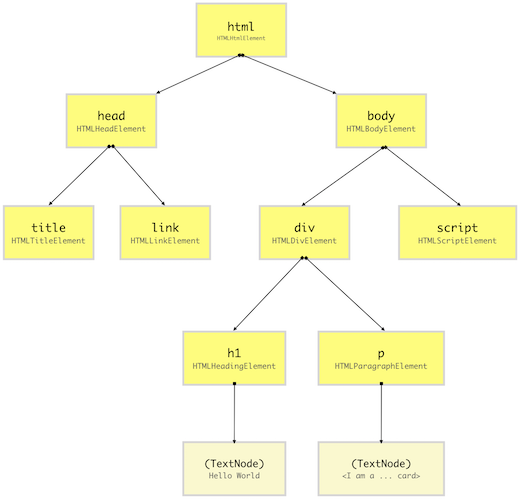
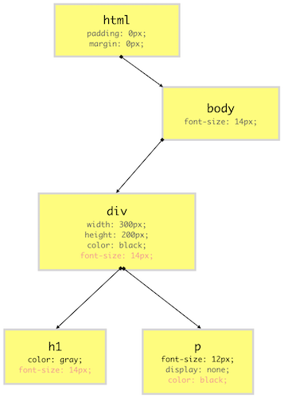
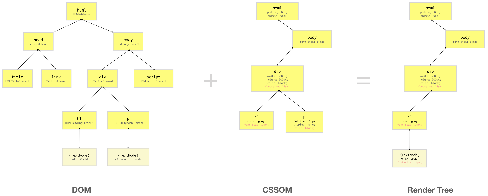
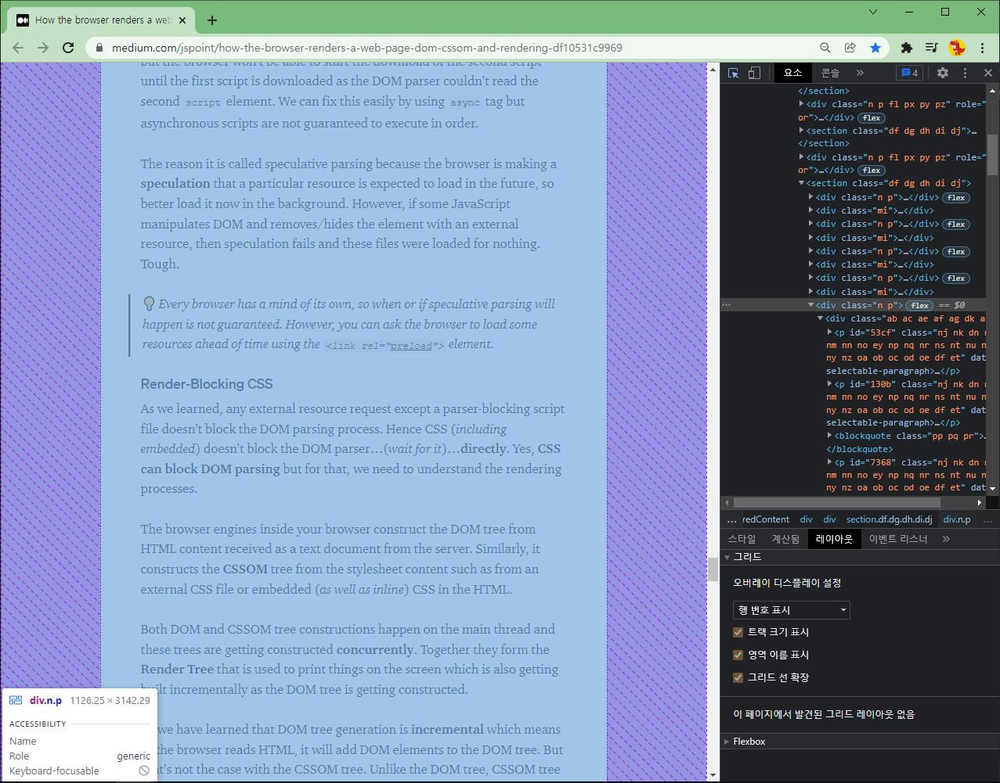
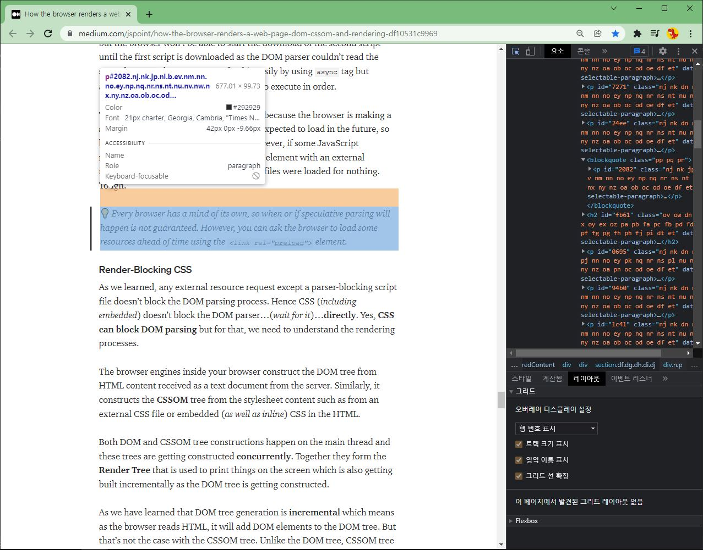
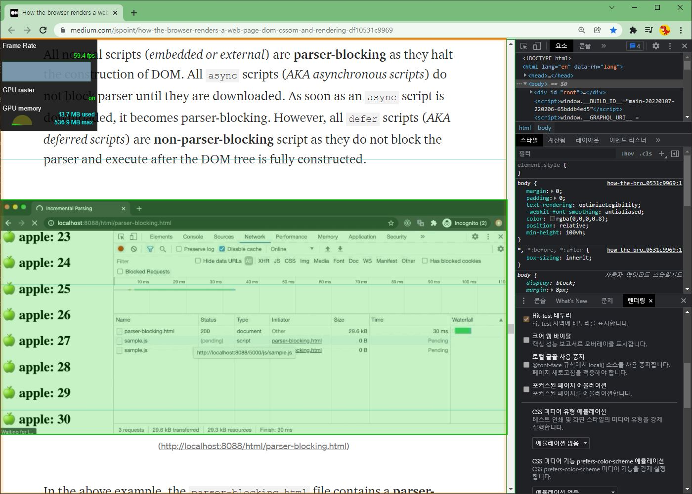

# Learning React
## Why react?
리액트를 사용하기 앞서, 어떻게 사용자의 브라우저가 웹 페이지를 렌더링 하는지를 이해할 필요가 있습니다.

<!--
추가 예정: 리액트의 가상 DOM과 Diff 알고리즘과 정책 이해하기
이것이 왜 효율적인지 이해하기. AJAX도 이해하기. Asynchronous Javascript and xml
Vue.js 와 Angular에 대해 간단하게 비교-정리하기 
리액트의 불편한 점, Javascript의 불편한 점 이야기하기. 
새로운 언어: Dart에 대해 소개하고 Dart:html, Dart:javascript, Dart:UI 이해하기 
새로운 프레임워크: Flutter에 대해 이해하기.
프론트엔드의 문제를 해결하는 접근법 (프레임워크에 독립적인), 일반적인 방법에 대해 이야기하기
-->
# Understand Rendering
아래의 문서는 Uday Hiwarale 의 <i><b><ins><a href="">How the browser renders a web page? - DOM, CSSOM, and rendering</a></ins></b></i>을 번역한 글입니다. 

이 글은 <ins>**DOM**</ins>, <ins>**CSSOM**</ins>, <ins>**Render-Tree**</ins> 에 대한 기초적인 이해와 <ins>**layer**</ins>, <ins>**draw**</ins>, <ins>**composite**</ins> 과정에 대해 소개하고 있습니다. 
## Understand Render Tree in Browser 
* [DOM TREE 이해하기](#understand-dom)
* [CSSOM TREE 이해하기](#css-object-model-cssom)
* [Render TREE 이해하기](#render-tree)

### Understand DOM
브라우저는 HTML 문서를 가져오기 위해서(<i>fetch</i>) 웹 서버에 요청(<i>request</i>)을 보냅니다.   
요청을 받은 서버는 <b>바이너리 스트림</b> 형태로 HTML 페이지를 반환합니다. 기본적으로 이것은 `content-type`헤더가 `text/html; charset=UTF-8`로 설정된 
텍스트 파일입니다.    
   

`text/html`은 <b>MIME TYPE</b>입니다. 이것은 브라우저에게 이 파일이 HTML 문서라는 것을 알려주는 역할을 합니다.   
`charset=UTF-8`은 이 문서의 인코딩이 UTF-8이라는 것을 브라우저에게 알려줍니다.   
이러한 정보를 토대로 브라우저는 바이너리 포맷을 읽을 수 있는 텍스트 파일로 변환할 수(<i>convert</i>) 있습니다.

만약 모든 것이 정상이라면, 브라우저는 이 텍스트 파일을 HTML 문서로서 읽기 시작할 것입니다.  

브라우저가 HTML 코드를 읽을 때 `html`, `body`, `div` 등과 같은 HTML 요소(<i>element</i>)를 만날 때 마다 <b>Node</b>라고 불리는 JavaScript 객체를 만들어냅니다.   
즉, 결과적으로 모든 HTML 요소들은 JavaScript 객체로 변환됩니다.
모든 HTML 요소들은 서로 다른 속성(<i>properties</i>)를 가지기 때문에, 각 노드 객체들은 서로 다른 클래스(<i>Constructor function</i>)로 만들어 질 것입니다. 
예를 들어, `div` 요소를 위한 Node 객체는 `Node`클래스를 상속받은 `HTMLDivElement`클래스에서 만들어집니다.   
   
브라우저가 HTML 문서로 부터 노드들을 만들어 낸 후, 이러한 노드 객체들에 대해 tree 구조를 생성해냅니다.
> <i>After the browser has created Nodes from the HTML document, it has to create a tree-like structure of these node objects.</i>

아래의 예시처럼 HTML 파일 속의 HTML 요소들은 서로 중첩 되어 있기에 브라우저는 각각에 대해 복제를 해야하지만 그 대신에 기존에 생성된 노드 객체를 사용합니다. 
이렇게 하면 브라우저가 생명주기 동안 웹 페이지를 더 효율적으로 렌더링하고 관리할 수 있습니다.    
```html
<!DOCTYPE HTML>
<html lang="ko">
<head>
    <title> HTML Example</title>
    <link rel="stylesheet" href="./style.css"/>
</head>
<body>
    <div class="container">
        <h1>Hello World</h1>
        <p>I am a card</p>
        <script src="./actions.js"></script>
    </div>
</body>
</html>
```
위 HTML 문서를 간단한 DOM Tree로 나타내면 다음과 같습니다.



DOM 트리는 최상단의 요소인 `html`로 부터 시작되어 HTML 요소의 생성 및 중첩에 따라 가지를 뻗어 나갑니다. 
> 💡 _DOM Node는 HTML 원소가 아닐 수도 있습니다. 브라우저가 DOM 트리를 생성할 때, 주석(<i>comments</i>), 속성들(<i>attributes</i>), 텍스트(<i>text</i>)과 같은 것들을 별도의 노드로 트리에 저장합니다._
>    
> _그러나 단순함을 위해 HTML 원소를 위한 DOM 노드, 즉 <i>DOM Element</i>들만 고려하도록 하겠습니다. 
> 모든 DOM 노드 타입들은 <a href="https://www.w3schools.com/jsref/prop_node_nodetype.asp">여기</a>에서 확인할 수 있습니다._

Google Chrome DevTools Console을 통해 DOM 트리를 시각화할 수 있습니다. 이 도구는 DOM 요소들의 계층 구조를 각 DOM 요소의 프로퍼티와 함께 보여줍니다.
   
자바스크립트는 DOM이 무엇인지 이해하지 못합니다. <ins><b>DOM은 자바스크립트의 명세가 아닙니다.</b></ins>
> <i>DOM is not part of the JavaScript specification.</i>

DOM은 브라우저가 제공하는 고수준의 Web API입니다. DOM을 통해 웹페이지를 효율적으로 렌더링할 수 있으며, 개발자는 다양한 목적을 위해 공개적으로 노출된 DOM 요소를 동적으로 조작할 수 있습니다.

> 💡 _DOM API를 사용하면 개발자는 HTML 요소들을 추가하거나 삭제할 수 있고 이것의 모습을 바꾸거나 이벤트 핸들러에 바인딩할 수 있습니다. 
> DOM API를 사용하면 렌더링된 DOM 트리에 영향을 주지않고 HTML 요소를 생성하거나 메모리에서 복제하고 조작할 수 있습니다. 개발자는 이것을 통해 풍부한 UX(사용자 경험)를 제공하는 매우 동적인 웹 페이지를 제작할 수 있습니다._

### CSS Object Model (CSSOM)
웹 디자인을 하는 의도가 무엇일까요? 최대한 보기 좋은 웹사이트를 만들기 위해서입니다. 우리는 HTML 요소에 몇가지 스타일(<i>style</i>)을 넣어 그것을 실현합니다. 
HTML 페이지에서 우리는 CSS(Cascade Style Sheet)를 사용해서 HTML 요소에 스타일을 갖춰줍니다. 
<a href="https://developer.mozilla.org/en-US/docs/Web/CSS/CSS_Selectors">CSS selector</a>를 사용해서 DOM요소를 지정하고 요소의 `color`나 `font-size`같은 스타일 프로퍼티의 값을 설정할 수 있습니다.

HTML요소에 스타일을 적용시키는 방법은 여러가지가 있습니다.
1. 외부 CSS 파일 사용하기 - (<i>external CSS file</i>)
2. `<style>`태그를 사용해서 내장 CSS 사용하기 - (<i>embedded CSS</i>)
3. HTML 요소의 `style`속성을 통해 인라인으로 스타일 적용하기
4. JavaScript 활용하기

어떠한 방법을 쓰든 결과적으로 브라우저는 DOM 요소에 CSS 스타일을 적용하기 위해 무거운 작업을 해야합니다.
   
앞서 제시한 HTML 예제에 아래의 CSS 스타일을 적용시켜보겠습니다.
이해를 쉽게 하기 위해서, 어떻게 HTML 페이지에서 CSS 스타일을 가져올 것인가는 신경쓰지 않겠습니다.
```css
html {
    padding: 0;
    margin: 0;
}
body {
    font-size: 10px;
}
.container {
    width: 300px;
    height: 300px;
    color: black;
}
.container > h1{
    color: gray
}
.container > p{
    font-size: 8px;
    display: none;
}
```
DOM을 생성한 후 브라우저는 _외부_, _내장형_, _인라인_, _user-agent_ 등 모든 소스에서 CSS를 읽고 <ins><b><a href="https://developer.mozilla.org/en-US/docs/Web/API/CSS_Object_Model">CSSOM</a></b></ins>을 생성합니다.
CSS Object Model(CSSOM) 도 DOM과 같은 Tree 구조입니다. 

CSSOM 트리의 각 노드는 CSS 스타일 정보를 가지고 있습니다. 이 스타일 정보들은 selector(지시자)에 의해 명시된 타겟 DOM 요소에 적용될 것입니다.
단, CSSOM은 `<meta>`, `<script>`, `<title>`등과 같이 화면에 출력되지 않을 DOM 요소에 대한것은 포함하고 있지 않습니다. 

대부분의 브라우저는 **user-agent stylesheet**라고 부르는 자신만의 스타일시트를 가지고 있습니다. 

브라우저는 먼저 개발자가 제공한 프로퍼티들을 <a href="https://developer.mozilla.org/en-US/docs/Web/CSS/Specificity">specificity 규칙</a>을 사용해서 user-agent styles를 오버라이딩(재정의)합니다.
그렇게 해서 DOM요소에 대한 최종 CSS 프로퍼티를 계산합니다. 그리고 노드를 생성합니다. 

HTML 요소에 대해 특정 CSS 프로퍼티(예를들어, `display`같은)가 개발자나 브라우저에 의해 정의되어 있지 않다면, 그 속성값은 <a href="https://www.w3schools.com/cssref/css_default_values.asp">W3C CSS 표준</a>에 의해 명시된 기본값으로 설정됩니다. 
CSS 속성의 기본값을 선택하는 동안 속성이 <a href="https://www.w3.org/TR/CSS1/#inheritance">W3C문서</a>에서 명시한대로 상속 자격이 있을 경우 일부 상속 규칙이 적용될 수 있습니다.

예를 들어, 특정 HTML요소에 대해 `color`와 `font-size`속성 값이 누락된 경우 부모의 값을 상속합니다. 따라서 HTML 요소와 그것을 상속하는 모든 자식들은 이러한 속성들을 가지고 있다고 생각할 수 있습니다.   

이러한 과정을 <b>cascading of styles</b>라고 부르며 이것이 CSS가 <b>Cascading Style Sheet</b>인 이유입니다. 브라우저는 트리구조인 CSSOM을 생성함으로써 CSS cascading 규칙에 따라 스타일을 계산할 수 있습니다.

> 💡 <i> Chrome DevTools Console의 Elements 패널을 통해 HTML 요소의 계산된 스타일을 볼 수 있습니다. (computed style)
> 왼쪽 패널에서 아무 HTML 요소를 선택한 후 오른쪽 패널의 computed 탭을 클릭하면 됩니다. </i>

앞서 보여준 CSS 예제의 CSSOM 트리를 아래의 다이어그램으로 시각화 할 수 있습니다. 간단하게 이해하기 위해, user-agent 스타일은 무시하고 예제의 CSS style에만 집중하겠습니다.

<!-- # TODO ) 이미지 추가하기 -->
다이어그램에서 볼 수 있듯이, 우리의 CSSOM 트리는 화면에 표시되지 않을 `<link>`, `<title>`, `<script>`와 같은 요소들은 포함하고 있지 않습니다. 
빨간색으로 표시된 CSS 프로퍼티 값은 위에서 cascade된 값이며 회색으로 표시된 값은 상속받은 값을 재정의(override)한 것입니다.

### Render Tree
앞서 우리는 HTML 요소들을 노드로 가지는 DOM Tree와 각 HTML 요소에 대한 Style 속성 집합을 노드로 가지는 CSSOM Tree에 대해 살펴봤습니다.

Render-Tree는 DOM트리와 CSSOM트리를 서로 결합하여 만들어진 트리구조입니다.
브라우저는 각각의 가시적인 요소들에 대해 <b>layout</b>을 계산할 수 있고 이 레이아웃을 화면에 <b>paint</b>해야합니다.   
브라우저는 이러한 작업을 하기 위해 Render-Tree를 사용합니다. 
따라서, Render-Tree가 생성되지 않는 한, 화면에는 아무것도 그려지지 않으며 그렇기에 DOM과 CSSOM트리 모두 필요합니다.

Render-Tree는 궁극적으로 화면에 출력되는 것에 대한 저수준의 표현이므로 픽셀 매트릭스의 어떤 영역도 보유하지 않는 노드는 Render-Tree에 포함되지 않습니다.
예를 들어, `display: none;`인 요소들은 `0px * 0px`의 차원을 가지며 따라서 Render-Tree에 포함되지 않습니다.

<!-- Todo )Render Tree 이미지 추가하기 -->


위 다이어그램에서 볼 수 있듯이, Render-Tree는 DOM과 CSSOM을 결합시킵니다. 그 결과 화면에 출력될 요소들만 포함하는 트리 구조가 생성됩니다. 

CSSOM에서 `p`요소는 `display: none;`로 스타일이 설정된 `div`안에 있기에 `p`와 `p`의 자식노드는 화면의 어떤 공간도 차지하지 않고 있고 Render-Tree에 나타나지 않습니다.
   
하지만 `visibility: hidden`이나 `opacity: 0`인 요소들은 화면의 공간을 점유하고 있기에 Render-Tree안에 존재하게 됩니다. 

DOM 트리 안의 DOM 요소들에 대해 접근할 수 있게 하는 DOM API와 달리, CSSOM은 사용자로 부터 숨겨지고 은닉되어있습니다. 

하지만 브라우저가 Render-Tree를 생성하기위해 DOM과 CSSOM을 결합하기 때문에, 브라우저는 DOM요소 자체에 대한 고수준의 API를 제공하여 각 DOM 요소에 대한 CSSOM 노드를 노출시킵니다.
> <i>But since the browser combines DOM and CSSOM to from the Render Tree, the browser exposes the CSSOM node of a DOM element by providing high-level API on the DOM element itself.</i>

이것은 개발자가 CSSOM노드의 CSS 프로퍼티에 접근하거나 변경할 수 있게 해줍니다.

> 💡 <i>CSSOM API에 대해 광범위한 스펙트럼을 다루는 [CSS Tricks Article](https://css-tricks.com/an-introduction-and-guide-to-the-css-object-model-cssom/) 에서 JavaScript로 element의 style을 조작하는 방법을 살펴볼 수 있습니다.    
> 또한 element의 스타일을 조작하는 더 적절한, 정확한 방법인 JavaScript의 [CSS Typed Object API](https://developers.google.com/web/updates/2018/03/cssom) 를 새롭게 살펴볼 수 있습니다. </i>

## Understand Rendering Sequence
이제 우리는 DOM, CSSOM, Render-Tree에 대해 확실한 개념들을 잡았습니다. 
이제부터는 브라우저가 어떻게 이러한 것들을 사용해서 일반적인 웹페이지들을 렌더링하는지 알아봅시다.
이 과정에 대해 깊게 이해하지 않으면 웹 개발에 있어 치명적일 수 있습니다. 
왜냐하면 이러한 개념과 과정들이 UX(사용자 경험)을 극대화 시키고 최적의 성능을 가지는 웹사이트를 디자인 할 수 있게 해주기 때문입니다.


웹 페이지가 로드될 때, 브라우저는 먼저 HTML 텍스트를 읽고 이것으로 부터 DOM Tree를 생성해냅니다. 
그리고 inline, embedded, external CSS로 부터 CSS를 처리해서 CSSOM Tree를 생성해냅니다. 

이것들이 생성되고 나면, 이 두 트리를 통해 Render-Tree를 생성해냅니다. 
Render-Tree가 생성되고 나면 브라우저는 각 독립적인 요소(element)들을 화면에 그리기 시작합니다. (출력하기 시작합니다.)

### Layout operation
제일 먼저, 브라우저는 각각의 독립적인 Render-Tree의 노드에 대한 레이아웃을 생성합니다.
이 레이아웃은 노드의 픽셀 단위의 <b>크기</b>와 화면에 출력될 <b>위치</b>로 구성됩니다.
이렇게 각 노드의 레이아웃 정보를 계산하는 과정, 다시 말해 노드의 위치와 크기를 계산하는 과정을 <b>layout</b>이라고 부릅니다.
<b>layout</b> 과정은 <b>reflow</b>, <b>browser reflow</b>라고도 부릅니다.    
> _By Paul Lewis.   
> 레이아웃은 브라우저가 요소의 기하학적 정보(페이지에서 차지하는 크기 및 위치)를 파악하는 장소입니다. 각 요소는 사용한 CSS, 요소의 콘텐츠 또는 상위 요소에 따라 명시적 또는 암시적 크기 지정 정보를 갖게 됩니다. 이 프로세스는 Chrome, Opera, Safari 및 Internet Explorer에서 레이아웃이라고 합니다. Firefox에서는 리플로우(reflow)라고 하지만 실제로는 동일한 프로세스입니다.
이 과정은 스크롤을 할 때나, 윈도우의 크기를 재조정할때나, DOM 요소들을 조작할 때도 발생할 수 있습니다._
> 
다음은 <b>layout/reflow</b>를 유발하는 이벤트 목록 입니다.

* insert, remove or update an element in the DOM
* modify content on the page, e.g. the text in an input box
* move a DOM element
* animate a DOM element
* take measurements of an element such as offsetHeight or getComputedStyle
* change a CSS style
* change the className of an element
* add or remove a stylesheet
* resize the window
* scroll
* changing the font
* activation of css pseudo classes such as :hover
* setting a property of the style attribute

<b>layout/reflow</b>은 비싼 작업입니다. 따라서 대수롭지 않은 이유로 웹페이지에 layout 연산을 여러번 하는 것을 피해야합니다.
Paul Lewis가 작성한 <a href="https://developers.google.com/web/fundamentals/performance/rendering/avoid-large-complex-layouts-and-layout-thrashing#%EB%A0%88%EC%9D%B4%EC%95%84%EC%9B%83_%EC%8A%A4%EB%9E%98%EC%8B%B1_%ED%94%BC%ED%95%98%EA%B8%B0">article</a>은 <i>layout thrashing</i>을 포함하여 복잡하고 비싼 layout 연산을 피하는 방법에 대해 설명하고 있습니다. 
### Paint operation
여기까지 우리는 화면에 출력해야하는 기하학적 요소들에 대한 리스트를 얻었습니다. 
render-tree의 요소들(혹은 sub-tree)는 서로 겹쳐질 수 있으며, 모습이나 위치, 혹은 기하학적 요소들을 자주 변경하는(애니메이션과 같은) CSS 프로퍼티를 가지고 있을수도 있습니다.
따라서 브라우저는 이것에 대한 <b>layer</b>를 생성합니다. 

레이어를 생성함으로써 브라우저는 스크롤이나 리사이즈 등과 같은 웹페이지의 생명주기 전반에 걸쳐 효율적인 painting(그리기) 연산을 수행할 수 있습니다.
또한 레이어를 통해 브라우저는 (<i>z-axis</i>를 따라) 올바른 순서로 요소들을 쌓으면서 그릴 수 있습니다.
> _Creating layers helps the browser efficiently perform painting operations throughout the lifecycle of a web page such as while scrolling or resizing the browser window. Having layers also help the browser correctly draw elements in the stacking order (along the z-axis) as they were intended by the developer._
> 
앞서 언급한 과정을 통해 이제 우리는 레이어들을 가지게 되었습니다. 
이 레이어들을 결합하여 화면에 그릴 수 있습니다.
하지만 브라우저는 모든 레이어를 한 번에 그리지는 않습니다. 우선 레이어들은 개별적으로 그려집니다.

브라우저는 <ins>각 레이어 내</ins>에서 요소에 표시되는 속성(테두리, 배경색, 그림자, 텍스트 등)에 대해 해당 픽셀을 채웁니다.
이 과정을 <b>rasterize</b>이라고도 합니다. (<b>draw/rasterize</b>)   
성능을 향상시키기 위해 브라우저는 다른 스레드들에서 rasterize를 수행합니다. 

Photoshop의 layer 개념은 브라우저의 렌더링 방식에도 적용될 수 있습니다. 


Google DevTools에서 웹페이지의 서로 다른 레이어들을 시각화 할 수 있습니다. 
DevTools의 레이어 항목을 선택하면 각 요소들의 레이어를 화면에서 확인할 수 있습니다.




또한 DevTools의 렌더링 패널에서 레이어의 경계선을 시각화 할 수 있으며 각종 렌더링 상태, 속성들을 볼 수 있습니다. 



> 💡 _rasterize는 일반적으로 CPU에서 수행되므로 느리며 비용이 많이 드는 연산입니다. 
> 이제 성능 향상을 위해 rasterize를 GPU에서 수행하는 새로운 기술들이 있습니다._   
> 
> _인텔의 해당 <a>기사</a>는 **painting 주제**에 대해 더 자세하게 다루고 있으며 꼭 읽기를 권장합니다.   
> **layer에 대한 개념**을 더 자세하게 이해하기 위해 이 <a>기사</a>를 반드시 읽어야합니다._


### Compositing operation
아직까지 우리는 화면에 단 하나의 픽셀도 그리지 않았습니다. 
우리가 지금까지 얻어 낸 것은 특정 순서로 화면에 그려져야 하는 개별 레이어 (_bitmap images_) 들입니다.
Composite(합성) 연산에서 이 레이어들은 최종적으로 화면에 그려지기 위해 GPU로 보내집니다.

그리기(draw)를 위해 전체 레이어를 보내는 것은 비효율적입니다. 
reflow(layout)이나 <a href="http://www.stubbornella.org/content/2009/03/27/reflows-repaints-css-performance-making-your-javascript-slow/">repaint</a> 할 때 마다 다시 전체 레이어가 보내질 것이기 때문입니다. 
따라서 레이어는 타일들로 분할되어 화면에 그려집니다. 

Chrome DevTool 렌더링 패널에서 이렇게 분할된 타일들을 시각화 할 수 있습니다. 

> _Repaint는 시각적으로는 변하지만 레이아웃에는 영향을 주지 않는 요소의 skin 이 변했을 때 발생합니다._   
> _예를 들면, `outline`, `visibility`, `background`, `color` 같은 프로퍼티들의 변화가 있습니다._
> 
> _Reflow는 페이지의 부분 혹은 전체 레이아웃에 영향을 주는 변화가 있을 때, 해당 레이아웃을 다시 만드는 작업입니다._   
> _예를 들어, 페이지 요소들을 추가하거나 제거할 때, 명시적 혹은 암시적으로 `width`, `height`, `font-family`, `font-size` 등이 변경되었을 때가 reflow가 발생합니다._   
> 
> _많은 경우 reflow가 발생한 후 repaint가 이어져 발생합니다._
> 

***
여기까지의 정보들 통해, 브라우저가 웹 페이지에서 진행하는 이벤트들의 시퀀스를 구성할 수 있습니다.    

이 이벤트의 시퀀스를 통해 브라우저는 HTML 나 CSS와 같이 간단한 텍스트 컨텐츠의 요소들을 화면에 렌더링할 수 있습니다. 


이 시퀀스를 <ins><b><a href="https://developer.mozilla.org/en-US/docs/Web/Performance/Critical_rendering_path">critical rendering path</a></b></ins>라고 부릅니다. 

### Browser engines
DOM 트리, CSSOM 트리를 생성하고 렌더링 로직을 처리하는 작업은 브라우저 엔진이 수행합니다.   

이 엔진은 브라우저에 포함된 소프트웨어의 조각입니다. 브라우저 엔진은 렌더링 엔진이나 레이아웃 엔진이라고도 불립니다.    

이 브라우저 엔진은 HTML 코드로 부터 화면 위 실제 픽셀로 웹 페이지를 렌더링하기 위해 필요한 모든 요소와 로직들을 포함하고 있습니다. 

사람들이 <b><ins>WebKit</ins></b>에 대해 이야기하는 것을 들어보셨다면, 그들은 브라우저 엔진에 대해 이야기하고 있었던 것입니다. 

<b>WebKit</b>은 Apple의 Safari 브라우저에서 사용되고있으며, 예전에 Google Chrome 브라우저의 기본 렌더링 엔진으로 사용됐었습니다.
현재 <b><ins>Chromium</ins></b> 프로젝트는 <b><ins>Blink</ins></b>를 기본 렌더링 엔진으로 사용하고 있습니다. 

<b>Blink</b>는 <b>Webkit</b>에서 fork 되어 나온 프로젝트입니다.
다음은 많이 사용되는 브라우저들에서 사용되는 브라우저 엔진들을 정리한 리스트입니다. 

* IE
  * Engine: Trident
  * CSS-prefix: `-ms`
* Edge
  * Engine: ~~EdgeHTML~~ → Blink
  * CSS-prefix: `-ms`
* Firefox
  * Engine: Gecko
  * CSS-prefix: `-moz`
* Opera
  * Engine: ~~Presto~~ → Blink
  * CSS-prefix: `-o` (Presto) and `-webkit` (Blink)
* Safari
  * Engine: WebKit
  * CSS-prefix: `-webkit`
* Chrome
  * Engine: ~~WebKit~~ → Blink
  * CSS-prefix: `-webkit`

## Rendering Process in Browsers
JavaScript 언어는 <a href="https://en.wikipedia.org/wiki/ECMAScript">ECMAScript</a> 표준에 의해 표준화되었습니다. 
<!--JavaScript 는 상표권 등록이 되어 있기 때문에, 상업적인 상황에서 ECMAScript 로 부르는 것이 권장됩니다.-->
그러므로 <b><ins><a href="https://v8.dev/">V8</a></ins></b>, <b><ins><a href="https://en.wikipedia.org/wiki/Chakra_(JavaScript_engine)">Chakra</a></ins></b>, <b><ins><a href="https://spidermonkey.dev/">Spider Monkey</a></ins></b>와 같은 모든 JavaScript 엔진 제공자는 해당 표준을 따라야합니다. 

JavaScript 표준의 제정은 JavaScript 코드가 브라우저, Node, Deno 등과 같은 모든 JavaScript 런타임에서 일관된 행동을 하게 해주었습니다.
이는 여러 플랫폼에서 JavaScript 및 웹 애플리케이션을 일관되고 완벽하게 개발할 수 있도록 만들어줍니다. 

하지만 브라우저가 렌더링하는 방식은 그렇지 않습니다. 

HTML, CSS, 자바스크립트, 이 세 언어들은 몇몇 집단과 조직에서 표준화되었습니다.
하지만 화면 렌더링을 하기 위해 브라우저가 <b>HTML/CSS/JS</b>를 통합하여 관리하는 방법은 표준화 되지 않았습니다.

즉, Google Chrome의 브라우저 엔진의 동작과 Safari의 브라우저 엔진의 동작은 다를 수 있습니다.

그러므로, 특정 브라우저에서의 렌더링 시퀀스와 그 이면의 메커니즘을 예측하는 것은 어렵습니다.   

<ins><b><a href="https://html.spec.whatwg.org/">HTML5 specification</a></b></ins>은 렌더링 작동 방식을 이론적으로 표준화하려고 노력했지만 브라우저가 이 표준을 준수하느냐는 전적으로 브라우저(개발자)들에게 달려있습니다. 

이러한 비일관성에도 불구하고, 모든 브라우저에서 일반적으로 동일한 몇몇 공통적인 원리가 있습니다.
브라우저가 화면에 렌더링하기 위해 사용하는 일반적인 접근법과 이 프로세스의 생명주기 이벤트에 대해 알아봅시다. 

이러한 프로세스를 이해하기 위해 서로 다른 렌더링 시나리오를 테스트하는 작은 [프로젝트](browser-rendering-test)를 준비했습니다.

## Parsing and External Resources
